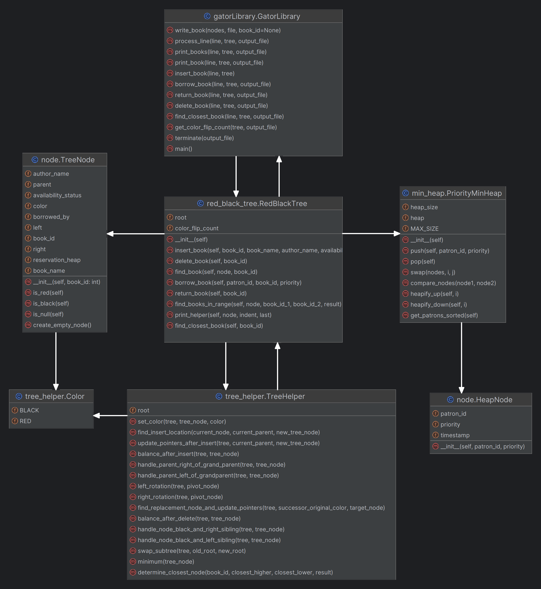

# Gator-Library-Management-System
A library management system that uses a red black tree as the database to store books and a priority min heap to manage the reservation list for the books

## Red Black Tree Implementation:
Each node has the following attributes
o	book_id: Unique numeric ID of the book.
o	parent: Pointer to parent of the node.
o	left: pointer to left child of the node.
o	right: pointer to right child of the node.
o	color: Color of the nods (Enum: RED or BLACK)
o	book_name: Name of the book
o	author_name: Name of the book’s author
o	availability_status: Yes|No value determining book’s availability.
o	borrowed_by: Patron ID who has borrowed the book or None
o	reservation_heap: Priority binary min heap that holds the waiting list for patrons who reserve the book when it is not available.

## Functions supported:
o	insert_book(self, book_id, book_name, author_name, availability_status, borrowed_by=None)
o	delete_book(self, book_id)
o	find_book(self, node, book_id)
o	borrow_book(self, patron_id, book_id, priority)
o	return_book(self, book_id):
o	find_books_in_range(self, node, book_id_1, book_id_2, result)
o	find_closest_book(self, book_id):

## Priority Min Heap Implementation:
Each node has the following attributes
o	patron_id: Patron ID of the borrower.
o	Priority: Priority of the patron.
o	timestamp: Automatically calculate and assign timestamp when node is created for tie resolution when two nodes have same priority.

## Functions supported:
o	push (self, patron_id, priority)
o	pop(self):
o	get_patrons_sorted(self):

## Flow Diagram

